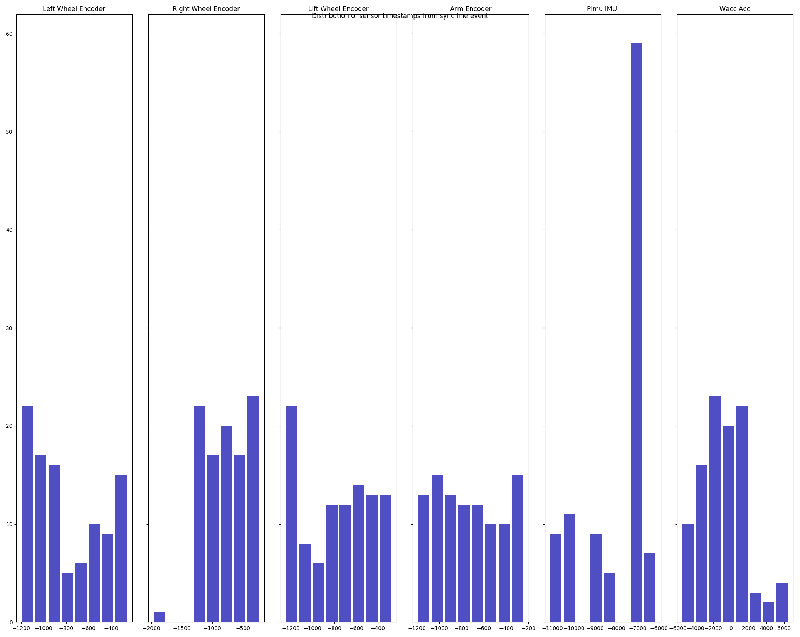

# 008_SYNC_TIMESTAMPS

### **Background**

Prior to this update the sensor data coming from Stretch Body was only timestamped using the Linux clock. Timestamping was done at the time of the read of the USB bus and was therefore subject to OS dependent jitter and accuracy.

Starting with this update Stretch has the ability to provide synchronized timestamps based on its microcontroller clock and a hardware sync line. Details on the timestamping function are found in this tutorial [Coming soon].

### Update Firmware

Install the latest version of the firmware for the Wacc, Pimu, and Steppers. 

NOTE: For now you will want the`sync_timestamp`branch of the git repository. You'll need to pull it down.

```bash
>>$ cd ~/repos
>>$ git clone https://github.com/hello-robot/stretch_firmware -b sync_timestamp
```

Then follow [the tutorial for upgrading firmware](https://github.com/hello-robot/stretch_firmware) (Note your Stretch may already have the Arduino IDE installed and configured). 

### Update YAML

Robots with serial numbers `stretch-re1-1001` to `stretch-re1-1022` will need to update their user YAML Add the following to `~/stretch_user/$HELLO_FLEET_ID/stretch_re1_user_params.yaml`

```
robot:
  log_to_console: 0
  use_time_manager: 1
pimu_clock_manager:
  n_slew_history: 25
  trs: 450.0
  use_skew_compensation: 1

robot_sentry:
  dynamixel_stop_on_runstop: 1

robot_timestamp_manager:
  sync_mode_enabled: 1
  time_align_status: 0

wacc_clock_manager:
  n_slew_history: 25
  trs: 687.0
  use_skew_compensation: 1
```

**Note**: This fix is only applied to the current user account. If there are other existing user accounts they will want to apply this fix as well. 

### Update Stretch Body

NOTE: For now pull down the  `sync_timestamp` branch of the git repository and install that.


```bash
>>$ cd ~/repos
>>$ git clone https://github.com/hello-robot/stretch_body -b sync_timestamp
>>$ cd ~/repos/stretch_body/body
>>$ ./local_install.sh
>>$ cd ../tools
>>$ ./local_install.sh
```

FUTURE:

First, move to the latest Stretch Body package (version >=0.0.20)

```
>>$ pip2 install hello-robot-stretch-body
```

Now test it out. Try running the timestamp jog tool.

```bash
>>$ stretch_robot_timestamps_jog.py --display
For use with S T R E T C H (TM) RESEARCH EDITION from Hello Robot Inc.
------ Timestamp Manager -----
Sync mode enabled    : 1
Status ID            : 121
Wall time            : 1607575532.977621
Hardware sync        : 1607575532.939872
Pimu IMU             : 1607575532.930712
Lift Encdoer         : 1607575532.938915
Arm Encoder          : 1607575532.938884
Right Wheel Encoder  : 1607575532.939187
Left Wheel Encoder   : 1607575532.938882
Wacc Accel           : 1607575532.934294
------ Timestamp Manager -----
Sync mode enabled    : 1
Status ID            : 125
Wall time            : 1607575533.187324
Hardware sync        : 1607575533.148872
Pimu IMU             : 1607575533.140704
Lift Encdoer         : 1607575533.147775
Arm Encoder          : 1607575533.148192
Right Wheel Encoder  : 1607575533.148234
Left Wheel Encoder   : 1607575533.147883
Wacc Accel           : 1607575533.142721
...


```

```
>>$ stretch_robot_timestamps_jog.py --sensor_stats
```



That's it!


