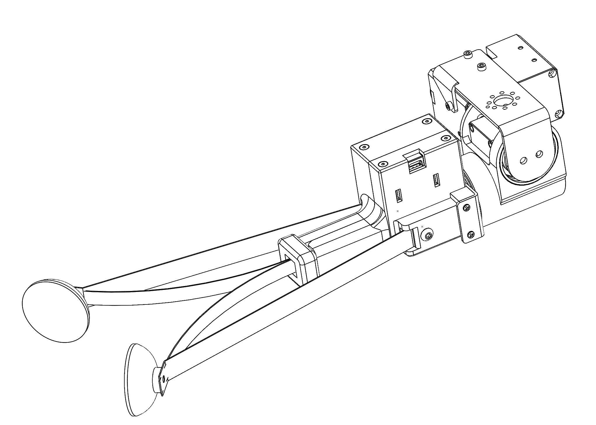
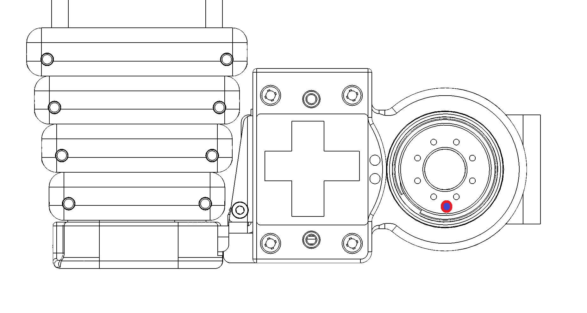
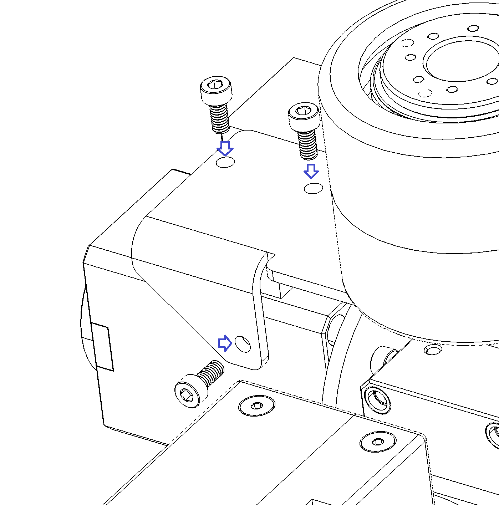
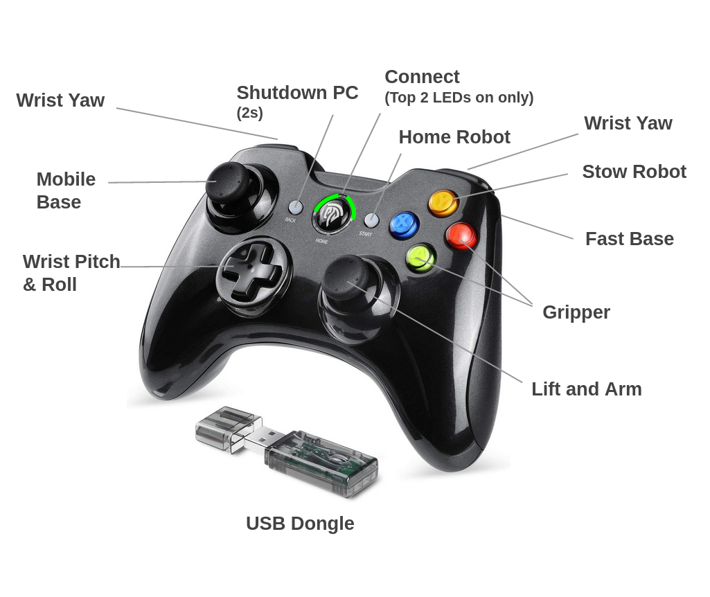
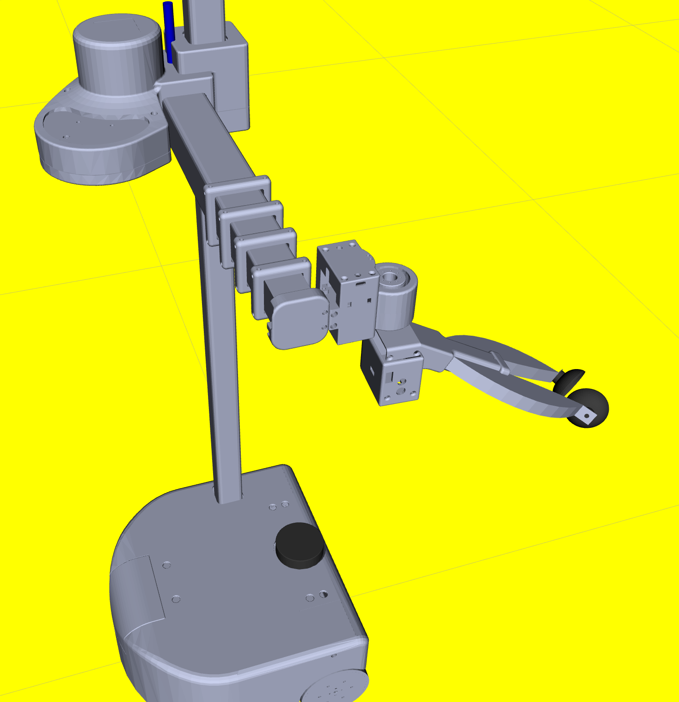

# 012_DEX_WRIST

## **Background**

This update installs and configures the Beta unit of the Stretch Dex Wrist - Beta. The procedure involves

2. Install and configure the new Wacc board
3. Install Stretch software packages
4. Attach the Dexterous Wrist
5. Update the Dynamixel servo baud rates
6. Update the robot YAML
7. Test the wrist with the XBox controller
8. Configure for use in ROS



## Install and configure the new Wacc board

Robots prior to the 'Joplin' batch will need an upgraded Wacc board that will be provided by Hello Robot.

See the update [013_WACC_INSTALL](./013_WACC_INSTALL/README.md) 

## Install Stretch Body Software Packages

You'll be installing a local beta version of relevant Stretch Body packages

```bash
>>$ cd ~/repos
>>$ mkdir dex_wrist
>>$ cd dex_wrist

>>$ git clone --branch feature/pluggable_end_effectors  https://github.com/hello-robot/stretch_body
>>$ git clone --branch feature/pluggable_end_effectors https://github.com/hello-robot/stretch_tool_share

>>$ cd stretch_body/body
>>$ ./local_install.sh
>>$ cd ../tools
>>$ ./local_install.sh
>>$ pip2 install urdfpy

>>$ pip2 install hello-robot-stretch-tool-share
>>$ cd ../../stretch_tool_share/python
>>$ ./local_install.sh

>>$ pip2 install hello-robot-stretch-factory
```


## Attach the Dexterous Wrist

First, remove the standard Stretch Gripper if it is still attached [according to the Hardware User Guide](https://docs.hello-robot.com/hardware_user_guide/#gripper-removal). 

Next, note where the forward direction is on the wrist yaw tool plate. The forward direction is indicated by the  additional alignment hole that is just outside the bolt pattern (shown pointing down in the image)



Next, using a Philips screwdriver, attach the wrist mount bracket to the bottom of the tool plate using the provided  M2 bolts. 

**NOTE: ensure that the forward direction of the bracket (also indicated by an alignment hole) matches the forward direction of the tool plate.**


![![]](./images/dex_wrist_B.png)

Next, raise the wrist module up vertically into the mounting bracket, then sliding it over horizontally so that the bearing mates onto its post. Slide in the 3D printed spacer between the pitch servo and the mounting bracket.

![![]](./images/dex_wrist_D.png)

![![]](./images/dex_wrist_F.png)

Finally, attach the body of the pitch servo to the mounting bracket using the 3 M2.5 screws provided. (**NOTE: Flat head screws provided, socket head screws shown below.)**



## Update the Dynamixel servo baud rates

The new wrist requires moving to 115200 Baud communication for all Dynamixel servos from the previous 57600.

```bash
>>$ RE1_dynamixel_set_baud.py /dev/hello-dynamixel-head 11 115200
---------------------
Checking servo current baud for 57600
----
Identified current baud of 57600. Changing baud to 115200
Success at changing baud

>>$ RE1_dynamixel_set_baud.py /dev/hello-dynamixel-head 12 115200
---------------------
Checking servo current baud for 57600
----
Identified current baud of 57600. Changing baud to 115200
Success at changing baud

>>$ RE1_dynamixel_set_baud.py /dev/hello-dynamixel-wrist 13 115200
---------------------
Checking servo current baud for 57600
----
Identified current baud of 57600. Changing baud to 115200
Success at changing baud
```


## Update the robot YAML

The new wrist requires a number of updates to the robot YAML

YAML doesn't allow definition of multiple fields with the same name. Depending on what is already listed in your YAML you may need to manually edit and merge fields. 

Add the following to you your  `~/stretch_user/$HELLO_FLEET_ID/stretch_re1_user_params.yaml`

```yaml
factory_params: stretch_re1_factory_params.yaml

params:
  - stretch_tool_share.stretch_dex_wrist_beta.params

head:
  baud: 115200

end_of_arm:
  baud: 115200
  tool: tool_stretch_dex_wrist
  #tool: tool_stretch_gripper

robot:
  use_collision_manager: 1

head_pan:
  baud: 115200

head_tilt:
  baud: 115200

wrist_yaw:
  baud: 115200

stretch_gripper:
  baud: 115200
  range_t:
    - 0
    - 6667
  zero_t: 3817

lift:
  i_feedforward: 0.75

hello-motor-lift:
  gains:
    i_safety_feedforward: 0.75


```

Each user account on Stretch will need to update their YAML as well. It is recommended practice to stored a reference of the YAML in /etc so that it will be available to other (new) user  accounts.

```bash
>>$ cd ~/stretch_user/$HELLO_FLEET_ID
>>$ sudo cp *.yaml /etc/hello-robot/$HELLO_FLEET_ID
```

## Configure for use in ROS

First pull down the new stretch_ros branch and copy in the tool description:

```bash
>>$ cd ~/catkin_ws/src/stretch_ros/
>>$ git pull
>>$ git checkout feature/pluggable_end_effector

>>$ cd ~/repos/dex_wrist/stretch_tool_share/tool_share/stretch_dex_wrist_beta/stretch_description
>>$ cp urdf/stretch_dex_wrist_beta.xacro ~/catkin_ws/src/stretch_ros/stretch_description/urdf
>>$ cp meshes/*.STL ~/catkin_ws/src/stretch_ros/stretch_description/meshes
```

Now configure `stretch_description.xacro` to use the StretchDexWrist tool:

```bash
>>$ nano ~/catkin_ws/src/stretch_ros/stretch_description/urdf/stretch_description.xacro
```

to read,

```bash
<?xml version="1.0"?>
<robot xmlns:xacro="http://www.ros.org/wiki/xacro" name="stretch_description">
  <xacro:include filename="stretch_dex_wrist_beta.xacro" />
  <xacro:include filename="stretch_main.xacro" />
  <xacro:include filename="stretch_aruco.xacro" />
  <xacro:include filename="stretch_d435i.xacro" />
  <xacro:include filename="stretch_laser_range_finder.xacro" />
  <xacro:include filename="stretch_respeaker.xacro" />
</robot>
```

Update your URDF and then export the URDF for Stretch Body to use  (you may need to Ctrl-C to exit `rosrun`)

```bash
>>$ rosrun stretch_calibration update_urdf_after_xacro_change.sh
>>$ cd ~/catkin_ws/src/stretch_ros/stretch_description/urdf
>>$ ./export_urdf.sh
```

## Test the wrist with the XBox Controller

Try out the new wrist! Note that the new key mapping does not allow for control of the head. 



```bash
>>$ stretch_xbox_controller_teleop.py
```

A printable copy of the teleoperation interface is [here](stretch_re1_dex_wrist_teleop_guide.pdf)

## Test the wrist with RViz

Now check that the wrist appears in RVIZ and can be controlled from the keyboard interface:

```bash
>>$ roslaunch stretch_calibration simple_test_head_calibration.launch
```

The menu interface is:

```
---------- KEYBOARD TELEOP MENU -----------|
|                                           |
|                 i HEAD UP                 |
|     j HEAD LEFT          l HEAD RIGHT     |
|                , HEAD DOWN                |
|                                           |
|                                           |
|  7 BASE ROTATE LEFT   9 BASE ROTATE RIGHT |
|         home                page-up       |
|                                           |
|                                           |
|                 8 LIFT UP                 |
|                 up-arrow                  |
|    4 BASE FORWARD         6 BASE BACK     |
|      left-arrow           right-arrow     |
|                2 LIFT DOWN                |
|                down-arrow                 |
|                                           |
|                                           |
|                 w ARM OUT                 |
|   a WRIST FORWARD        d WRIST BACK     |
|                 x ARM IN                  |
|                                           |
|                                           |
|   c PITCH FORWARD        v PITCH BACK     |
|    o ROLL FORWARD         p ROLL BACK     |
|              5 GRIPPER CLOSE              |
|              0 GRIPPER OPEN               |
|                                           |
|   step size:  b BIG, m MEDIUM, s SMALL    |
|                  q QUIT                   |
|                                           |
|-------------------------------------------|
```





# Using the Stretch Dex Wrist

Additional care should be taken when working with the Dex Wrist as it is now easier to accidentally collide the wrist and gripper with the robot, particularly during lift descent. 

We've implemented a very coarse collision avoidance behavior in Stretch Body that is turned on by default. It is conservative and doesn't fully prevent collisions however. The collision avoidance can be turned off in the user YAML by:

```yaml
collision_stretch_dex_wrist_to_base:
  enabled: 0

collision_stretch_dex_wrist_to_self:
  enabled: 0

```

You can jog the individual joints of the wrist using the tool:

```bash
>>$ stretch_dex_wrist_jog.py --pitch
```

Control of the Stretch Dex Wrist uses the same interfaces as the rest of the Stretch Body Robot joints.  For example:

```python
import stretch_body.robot
robot=stretch_body.robot.Robot()
robot.startup()

#Move arm to safe manipulation location
robot.stow()
robot.lift.move_to(0.4)
robot.push_command()
time.sleep(2.0)

#Pose the Dex Wrist
robot.end_of_arm.move_to('wrist_yaw',0)
robot.end_of_arm.move_to('wrist_pitch',0)
robot.end_of_arm.move_to('wrist_roll',0)
robot.end_of_arm.move_to('stretch_gripper',50)
time.sleep(2.0)

#Go back to stow and shutdown
robot.stow()
robot.stop()

```


For reference, the parameters for the Stretch Dex Wrist (which can be overriden in the user YAML) are found

 at `.local/lib/python2.7/site-packages/stretch_tool_share/stretch_dex_wrist_beta/params.py`

