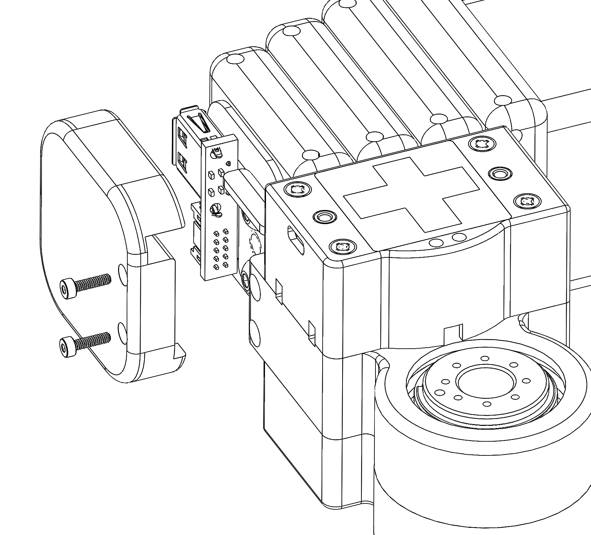
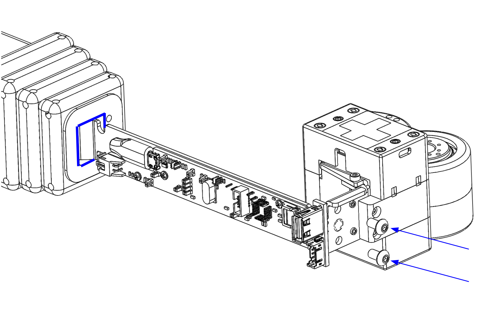
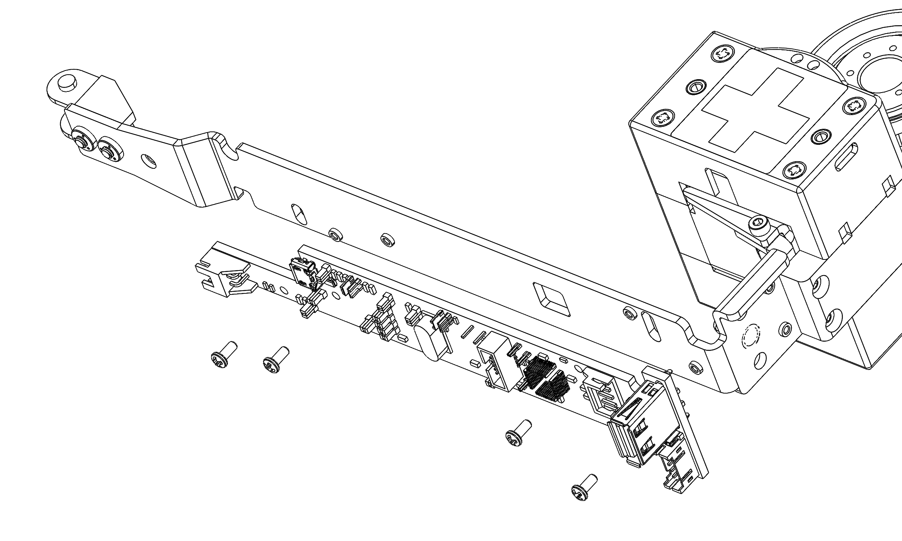
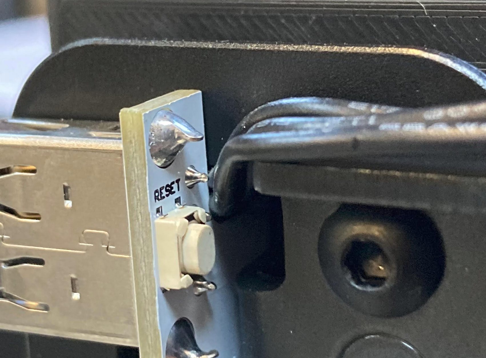

# 013_WACC_INSTALL

## **Background**

This update installs and configures a new Wacc (Wrist + Accelerometer) board. You will need

- Replacement Wacc board
- USB-A to USB-micro cable
- 1.5mm Hex wrench
- 2.5mm Hex wrench
- Small flat head screw driver or similar
- Loctite 242 (blue)


## Update the Wacc board serial numbers

First, on the robot run:

```bash
>>$ cd ~/repos
>>$ git clone https://github.com/hello-robot/stretch_factory
>>$ chmod a+rw $HELLO_FLEET_PATH/$HELLO_FLEET_ID/udev/*
```

Now attach the USB cable into a USB port of the robot trunk. Run the updating tool as shown below. You will
- Plug in USB when prompted
- Hit enter
- Unplug and plug in USB when prompted
- Hit enter


```bash
>>$ cd stretch_factory/updates/013_WACC_INSTALL
>>$ sudo dmesg -c
>>$ ./add_new_wacc_pcba.py 
----------------------
Adding WACC PCBA to robot:  stretch-re1-1039
Plug / Reset Dynamixel device now...
Press return when done

[1035443.643968] usb 1-1.3.2.1: new high-speed USB device number 12 using xhci_hcd
[1035443.844182] usb 1-1.3.2.1: New USB device found, idVendor=1a40, idProduct=0101
[1035443.844199] usb 1-1.3.2.1: New USB device strings: Mfr=0, Product=1, SerialNumber=0
[1035443.844208] usb 1-1.3.2.1: Product: USB 2.0 Hub
[1035443.845851] hub 1-1.3.2.1:1.0: USB hub found
[1035443.845923] hub 1-1.3.2.1:1.0: 4 ports detected
[1035444.252052] usb 1-1.3.2.1.2: new full-speed USB device number 15 using xhci_hcd
[1035444.479616] usb 1-1.3.2.1.2: New USB device found, idVendor=0403, idProduct=6001
[1035444.479625] usb 1-1.3.2.1.2: New USB device strings: Mfr=1, Product=2, SerialNumber=3
[1035444.479631] usb 1-1.3.2.1.2: Product: FT232R USB UART
[1035444.479636] usb 1-1.3.2.1.2: Manufacturer: FTDI
[1035444.479640] usb 1-1.3.2.1.2: SerialNumber: AQ00X8TJ
[1035444.483900] ftdi_sio 1-1.3.2.1.2:1.0: FTDI USB Serial Device converter detected
[1035444.484043] usb 1-1.3.2.1.2: Detected FT232RL
[1035444.484466] usb 1-1.3.2.1.2: FTDI USB Serial Device converter now attached to ttyUSB3
[1035445.459995] usb 1-1.3.2.1.3: new full-speed USB device number 17 using xhci_hcd

---------------------------
Found Dynamixel device with SerialNumber AQ00X8TJ
Writing UDEV for  AQ00X8TJ
Overwriting existing entry...
Plug / Reset in Arduino device now...
Press return when done

---------------------------
Found Arduino device with SerialNumber C209885C50524653312E3120FF101E39
Writing UDEV for  hello-wacc C209885C50524653312E3120FF101E39
Overwriting existing entry...
---------------------------
Found Arduino device with SerialNumber C209885C50524653312E3120FF101E39
Writing UDEV for  hello-wacc C209885C50524653312E3120FF101E39
Overwriting existing entry...

```

## Install the new Wacc board

1. Power down the robot from Ubuntu and turn off the main power switch.

2. Remove the standard Stretch Gripper if it is still attached [according to the Hardware User Guide](https://docs.hello-robot.com/hardware_user_guide/#gripper-removal). 

3. Manually pose the lift height and arm such that the wrist can sit on a table top in order to support the wrist weight during disassembly

4. Using the 1.5mm wrench, remove the two M2 bolts holding the plastic cap to the end of the wrist 

   

5. Using the 2.5mm wrench, remove the two M4 bolts (blue arrows) holding the wrist module to the end of arm

6. Slide the wrist module out of the arm tube while supporting the weight of the module so that it remains parallel to the ground.  Take care that the Wacc board clears the surrounding metal structure (shown in blue)




6. With the screw driver, push back and dislodge the JST power cable and USB cable from the back of the Wacc board. Remove the JST servo cable at the front of the board.
7. Using the 1.5mm wrench, remove the 4 M2 bolts holding the Wacc board to the sheetmetal frame. 
8. Attach the replacement board onto the sheetmetal frame using the provided 4 M2 bolts



6. Reattach the USB and power cables to back of Wacc
7. Carefully route the Dynamixel servo cable out of the arm as shown such that no cables are pinched when attaching the plastic cap.



11. Carefully slide the wrist module back into the arm. Ensure that the cables are fully seated.

10. Apply Loctite to the two M4 bolts. Secure the wrist module to the arm with the bolts. then attach the plastic cap with the two M2 bolts. 


## Check the Wacc functionality

Power the robot back on and check that the board is on the bus

```bash
>>$ ls /dev/hello-dynamixel-wrist
hello-dynamixel-wrist
>>$ ls /dev/hello-wacc
hello-wacc
```

Then check that the Wacc is reporting sensor data back:

```bash
>>$  stretch_wacc_jog.py 
For use with S T R E T C H (TM) RESEARCH EDITION from Hello Robot Inc.

------ MENU -------
m: menu
r: reset board
a: set D2 on
b: set D2 off
c: set D3 on
d: set D3 off
-------------------

------------------------------
Ax (m/s^2) 9.8684213638
Ay (m/s^2) 0.506848096848
Az (m/s^2) 0.361166000366
A0 381
D0 (In) 1
D1 (In) 1
D2 (Out) 0
D3 (Out) 0
Single Tap Count 25
State  0
Debug 0
Timestamp 1601320914.65
Board version: Wacc.Guthrie.V1
Firmware version: Wacc.v0.0.1p0
------ MENU -------
m: menu
r: reset board
a: set D2 on
b: set D2 off
c: set D3 on
d: set D3 off
-------------------

```

Finally, home the wrist yaw joint to ensure that it is working.

```bash
>>$ stretch_wrist_yaw_home.py 
For use with S T R E T C H (TM) RESEARCH EDITION from Hello Robot Inc.

Moving to first hardstop...
Contact at position: -3029
Hit first hardstop, marking to zero ticks
Raw position: 14
Moving to calibrated zero: (rad)

```

## Update Wacc Calibration

```bash
>>$ RE1_wacc_calibrate.py
RE1_wacc_calibrate.py 
Calibrating Wacc. Ensure arm is retracted and level to ground
Hit enter when ready

Itr 0 Val 9.59977857901
...
Itr 99 Val 10.1095601333
Got a average value of 10.1372113882
Gravity scalar of 0.967391 within bounds of 0.900000 to 1.100000
Writing yaml...

```
Note: If the RE1* tools are not present you can install them as

```bash
>>$ pip2 install hello-robot-stretch-factory
```
