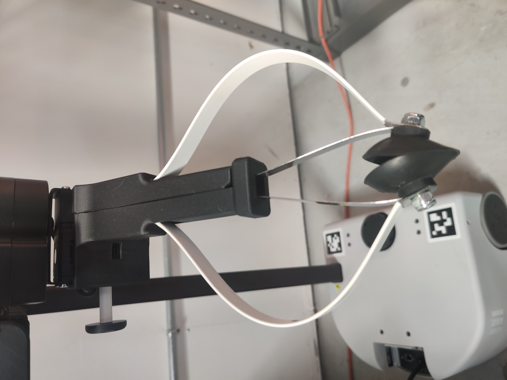
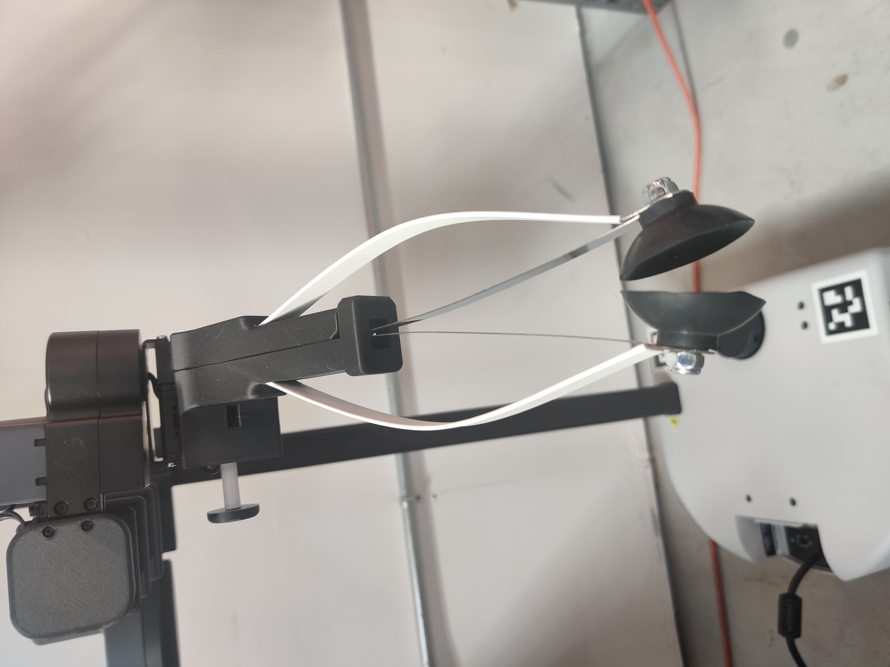
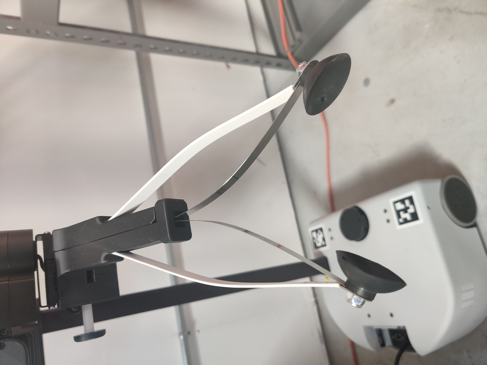

# 018_GRIPPER_CALIBRATION

### **Background**

The Stretch gripper is calibrated to define the closed position, 'zero' or home position, and fully open position of the gripper. 
Recalibrating may be necessary if replacing the gripper, or if the gripper is not performing correctly. 

### Gripper Calibration
First, move to the latest Stretch Factory package (version >=0.0.14)

```
>>$ pip2 install hello-robot-stretch-factory
```
Now run the gripper calibration script. This script will take you through the step-by-step process of calibration.
1. First, the script automatically finds the gripper closed position.
```bash
>>$ RE1_gripper_calibrate.py 
Hit enter to find zero
Moving to first hardstop...
Contact at position: 0
Hit first hardstop, marking to zero ticks
Homing is now  4895
Raw position: 12
Moving to calibrated zero: (rad)
```
<br/>

2. Next you are asked to manually set the 'zero' or home position, entering '1' or '2' to open or close the fingers until they barely don't touch, as pictured. 
```bash
---------------------------------------------------
Enter 1 to open fingers. Enter 2 to close fingers. Enter 3 when the fingertips are just barely not touching.
1
1
1
1
1
2
3
('Setting zero at:', 5639)
```
<br/>
3. Next you are asked to manually set the fully open position, entering '1' or '2' to open or close the fingers until the fingers are fully open and stop moving.
```bash
---------------------------------------------------
Enter 1 to open fingers. Enter 2 to close fingers. Enter 3 when the fingertips are fully open, 
and no further opening motion is possible
1
1
.
.
.
1
2
3
('Setting open at:', 8500)
```
<br/>
4. Finally, the script would move the gripper to close, open and zero positions. Verify that the gripper moves to the expected poses and save the calibration.
```bash
Hit enter to close
Hit enter to open
Hit enter to go to zero
Save calibration [y]?y
```


